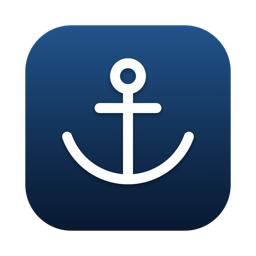
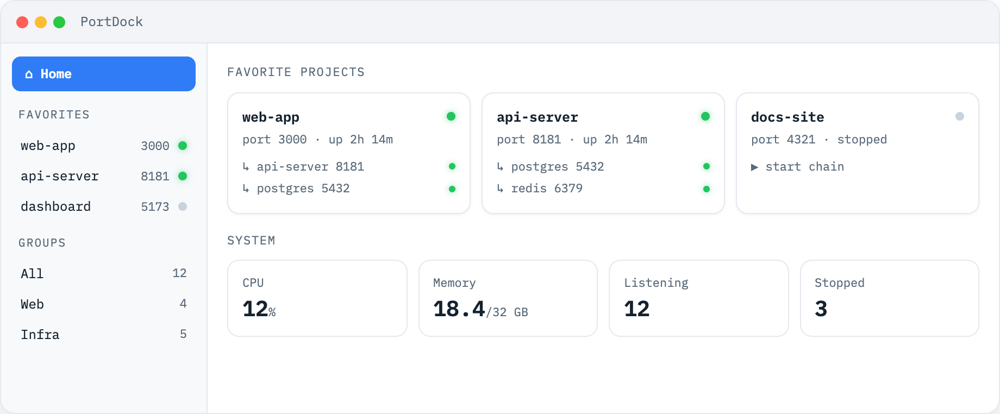

<div align="center">
  
  <h1>PortDock</h1>
  <p><strong>See what's docked on your ports.</strong> ⚓</p>
  <p>
    <a href="https://lurenkt.github.io/PortDock/">Website</a> ·
    <a href="https://github.com/LurenKT/PortDock/releases/latest">Download</a> ·
    <a href="README.zh-CN.md">中文说明</a>
  </p>
</div>

PortDock is a native macOS monitor for local dev services — every listening port, its process, its dependencies, and one click to start the whole chain.



## Features

- **Port-first view** — every listening TCP port with its process, project, uptime, and HTTP reachability
- **Dependency detection** — discovers which services talk to which (via live TCP connections) and draws the tree
- **Cascade start** — start a service and its dependencies in one click, in dependency order; restart a whole group from its tree root
- **Menu bar quick actions** — start / restart / stop favorites and open them in the browser without leaving the menu bar
- **System glance** — CPU, memory, listening/stopped counts up top; heaviest process trees ranked below, expandable
- **Favorites & grouping** — pin your projects, auto-grouped by type (web / agent / infra)
- **LAN share** — optionally expose the dashboard to your local network
- **English & 中文** — follows your system language, switchable in Settings (⌘,)
- **Zero Electron** — a single native SwiftUI binary, no runtime dependencies, no telemetry

## Install

Download the latest `.dmg` from [Releases](https://github.com/LurenKT/PortDock/releases/latest) and drag PortDock to Applications. Signed & notarized by Apple — it opens without warnings.

Requires macOS 14.0+ (Apple Silicon & Intel).

## Why trust a process monitor?

It's fully open source and tiny (~3k lines of Swift). It only reads output from the system's own `lsof` and `ps`, probes local HTTP ports, and writes one JSON config file (`~/.portdock/services.json`). No telemetry, no network egress — everything stays on your machine.

## Build from source

```bash
./build.sh   # needs Xcode command line tools
open build/PortDock.app
```

## License

[MIT](LICENSE)
