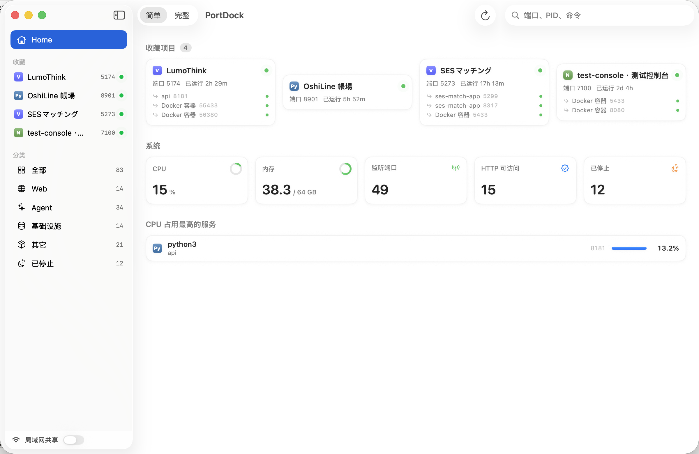

# PortDock ⚓

**See what's docked on your ports.** A native macOS app that shows every local dev service — which port it listens on, what depends on what, and one click to start the whole chain.



## Features

- **Port-first view** — every listening TCP port with its process, project, uptime, and HTTP reachability
- **Dependency detection** — discovers which services talk to which (via established TCP connections) and draws the parent/child tree
- **Cascade start** — start a service and its dependencies in one click; saved to `~/.portdock/services.json`
- **Favorites & grouping** — pin your projects, auto-grouped by type (web / agent / infra)
- **System glance** — CPU, memory, listening/stopped counts at the top
- **LAN share** — optionally expose the dashboard to your local network
- Zero Electron, zero runtime dependencies — a single native SwiftUI binary

> UI is currently Chinese-first. English localization is on the roadmap.

## Install

Download the latest `.dmg` from [Releases](https://github.com/LurenKT/PortDock/releases), drag PortDock to Applications. Signed & notarized.

Requires macOS 14.0+ (Apple Silicon & Intel).

## Why trust a process monitor?

It's fully open source and tiny (~3k lines of Swift). It only reads output from the system's own `lsof` and `ps`, probes local HTTP ports, and writes one JSON config file. No telemetry, no network egress — everything stays on your machine.

## Build from source

```bash
./build.sh   # needs Xcode command line tools
open build/PortDock.app
```

## License

[MIT](LICENSE)
