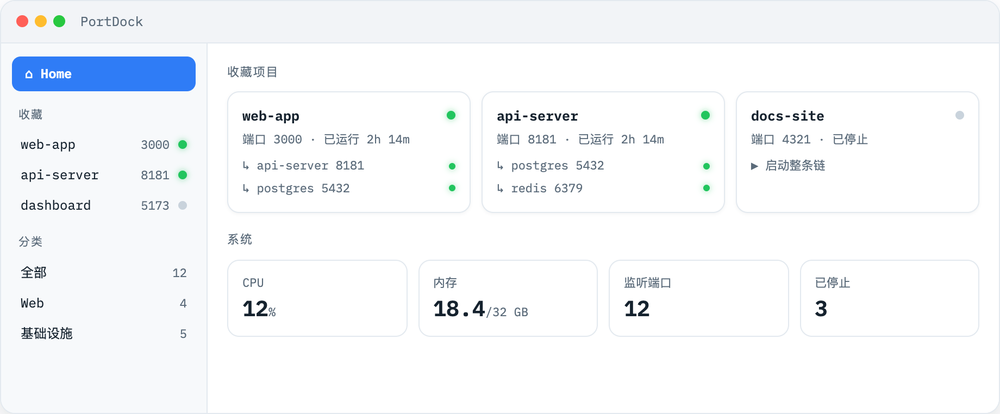

<div align="center">
  
  <h1>PortDock</h1>
  <p><strong>看清每个端口上停着什么。</strong> ⚓</p>
  <p>
    <a href="https://lurenkt.github.io/PortDock/">官网</a> ·
    <a href="https://github.com/LurenKT/PortDock/releases/latest">下载</a> ·
    <a href="README.md">English</a>
  </p>
</div>

PortDock 是原生 macOS 本地服务监控 —— 每个监听端口、背后的进程、服务之间的依赖,一键拉起整条链。



## 功能

- **端口视角** —— 每个监听端口的进程、所属项目、运行时长、HTTP 可达性,一眼看全
- **依赖探测** —— 通过真实 TCP 连接发现服务之间谁在调用谁,自动画出依赖树
- **级联启动** —— 一键按依赖顺序拉起服务和它依赖的一切;整组服务可从服务树根一键重启
- **菜单栏快捷操作** —— 收藏的服务在菜单栏直接启动、重启、停止、在浏览器打开
- **系统一瞥** —— CPU、内存、监听/停止数量置顶;占用最高的进程树排行在下,可展开
- **收藏与分类** —— 置顶你的项目,按类型自动分组(Web / Agent / 基础设施)
- **局域网共享** —— 可选择把面板暴露给局域网内其他设备
- **中英双语** —— 跟随系统语言,设置里可切换(⌘,)
- **零 Electron** —— 一个原生 SwiftUI 二进制,无运行时依赖、无遥测

## 安装

从 [Releases](https://github.com/LurenKT/PortDock/releases/latest) 下载最新 `.dmg`,把 PortDock 拖进「应用程序」即可。已经过 Apple 签名与公证,打开不会有任何警告。

要求 macOS 14.0+(Apple Silicon 与 Intel 均支持)。

## 凭什么信任一个进程监控器?

它完全开源,而且很小(约 3000 行 Swift)。它只读系统自带 `lsof` 和 `ps` 的输出、探测本地 HTTP 端口、写一个 JSON 配置文件(`~/.portdock/services.json`)。无遥测、不向外发任何数据 —— 一切都留在你的机器上。

## 从源码构建

```bash
./build.sh   # 需要 Xcode 命令行工具
open build/PortDock.app
```

## 协议

[MIT](LICENSE)
